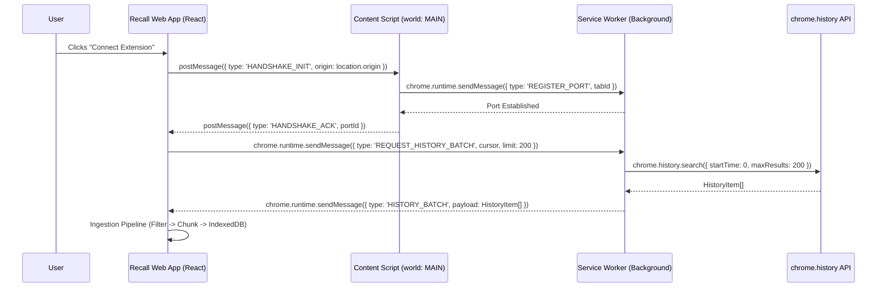

# Recall: Architecture & Technical Manual
**Version:** 1.0.0  
**Classification:** Internal – Production Grade  
**Author:** Principal Software Architect  
**Last Updated:** 2024-05-29  

---

## 1. Core Vision & Architectural Principles

### 1.1 Mission Statement
**Recall** is a privacy-first personal history intelligence platform. It transforms raw browser telemetry into structured, queryable, and semantically rich personal knowledge graphs—entirely on the client side. No raw browsing history ever leaves the user's device boundary.

### 1.2 The "Zero-Trust Client" Threat Model
We assume the network is hostile, the server is compromised, and the user is the sole root of trust.
*   **No Backend Persistence:** There is no database server. No authentication service. No analytics pipeline.
*   **Execution Sandbox:** All compute (filtering, embedding, LLM inference via WebLLM/ONNX, synthesis) executes inside the browser's renderer process or a dedicated Web Worker.
*   **Data Sovereignty:** The `indexedDB` instance (`recall_db`) is the single source of truth. It is encrypted at rest via the Web Crypto API (AES-GCM) using a key derived from a user-supplied passphrase (PBKDF2, 600k iterations).

### 1.3 Offline-First Architecture (Local-First Software)
*   **Primary Store:** `IndexedDB` (via `idb` wrapper for Promises/TypeScript safety).
*   **Schema Versioning:** Strict schema migrations using `IDBVersionChangeEvent`.
*   **Sync Strategy:** None (by design). Export/Import is manual, user-initiated, encrypted JSONL.
*   **Storage Quota Management:** Persistent storage requested via `navigator.storage.persist()`. Quota eviction policy: LRU on `raw_history` chunks older than 18 months if quota exceeded.

### 1.4 Technology Stack Matrix

| Layer | Technology | Rationale |
| :--- | :--- | :--- |
| **Framework** | React 18 + TypeScript (Strict Mode) | Concurrent features, Suspense for data fetching, type safety. |
| **Build** | Vite 5 (ESM only) | Instant HMR, optimized chunking, native ESM. |
| **State** | Zustand (Global) + React Query (Server State simulation) | Minimal boilerplate, atomic updates, selector optimization. |
| **Storage** | IndexedDB (`idb` v8) + Dexie.js (for complex queries) | Transactional, indexed, large quota. |
| **Extension Bridge** | Manifest V3, `chrome.runtime.sendMessage`, `postMessage` | Service Worker lifecycle, secure cross-origin messaging. |
| **AI/ML** | WebLLM (WASM) / Transformers.js (ONNX) | Client-side inference, zero server cost, privacy. |
| **Styling** | Tailwind CSS (JIT) + CSS Variables | Utility-first, design token enforcement, dark mode native. |
| **Testing** | Vitest (Unit), Playwright (E2E), MSW (Mocking SW) | Fast, browser-native testing. |

---

## 2. UI/UX Design Philosophy: "Editorial Minimalism"

### 2.1 Visual Language: The ZARA Aesthetic
Inspired by high-fashion editorial layouts: extreme restraint, typographic hierarchy as the primary UI element, and vast negative space acting as a cognitive buffer.

#### 2.1.1 Spatial System
*   **Base Unit:** `4px` (0.25rem).
*   **Macro Whitespace:** Sections separated by `24rem` (384px) vertical padding on desktop (`py-96`).
*   **Container Max-Width:** `42rem` (672px) – optimal reading measure (~65 chars/line).
*   **Layout:** Single column, centered. No sidebars, no cards with shadows, no borders.

#### 2.1.2 Typography Specification
*   **Font Stack:** `font-mono` (UI Mono, SF Mono, Menlo, Consolas, monospace).
*   **Headers (H1/H2):**
    *   `text-4xl md:text-6xl lg:text-7xl` (36px -> 72px -> 112px).
    *   `font-light` (300).
    *   `tracking-widest` (0.1em).
    *   `uppercase`.
    *   `text-zinc-900 dark:text-zinc-50`.
*   **Body Copy:**
    *   `text-base md:text-lg` (16px -> 18px).
    *   `font-normal` (400).
    *   `leading-relaxed` (1.625).
    *   `text-zinc-600 dark:text-zinc-400`.
*   **Metadata / Sub-labels (The "Chrome"):**
    *   `text-xs` (12px).
    *   `uppercase`.
    *   `tracking-wider` (0.05em).
    *   `font-medium` (500).
    *   `text-zinc-400 dark:text-zinc-500`.

#### 2.1.3 The "Thin Line" Metric System
Progress, scroll depth, and temporal density are visualized exclusively via **1px horizontal rules**.
*   **Implementation:** `<div class="h-px bg-zinc-200 dark:bg-zinc-800 overflow-hidden"><div class="h-full bg-zinc-900 dark:bg-zinc-50 transition-all duration-500 ease-out" style="width: {progress}%"></div></div>`
*   **Usage:** Daily activity density, ingestion pipeline status, search relevance confidence, timeline scroll position.

#### 2.1.4 Interaction & Motion
*   **Duration:** `300ms` standard, `500ms` for layout shifts.
*   **Easing:** `cubic-bezier(0.16, 1, 0.3, 1)` (Material "Emphasized Decelerate").
*   **Hover States:** Text color shift only (`zinc-600` -> `zinc-900`). No background fills, no box-shadows.
*   **Focus Visible:** `outline-none ring-1 ring-inset ring-zinc-900 dark:ring-zinc-50 offset-2`.

---

## 3. Chrome Extension Bridge (Manifest V3)

### 3.1 Architecture Overview
The Extension acts as a privileged **Data Acquisition Layer**. The Web App (`app.recall.local`) is the **Presentation & Compute Layer**. They communicate via a secured `postMessage` channel established through a `chrome.runtime.sendMessage` handshake.



### 3.2 Permission Model & Acquisition Flow
**Manifest (`manifest.json`):**
```json
{
  "manifest_version": 3,
  "name": "Recall Bridge",
  "version": "1.0.0",
  "permissions": ["history", "storage", "scripting"],
  "host_permissions": ["<all_urls>"],
  "background": { "service_worker": "background.js", "type": "module" },
  "content_scripts": [{
    "matches": ["<all_urls>"],
    "js": ["contentScript.js"],
    "run_at": "document_idle",
    "world": "MAIN"
  }],
  "externally_connectable": {
    "matches": ["*://app.recall.local/*", "http://localhost:5173/*"]
  },
  "content_security_policy": {
    "extension_pages": "script-src 'self' 'wasm-unsafe-eval'; object-src 'self'"
  }
}
```

**Runtime Permission Request (Web App Side):**
```typescript
// hooks/useExtensionBridge.ts
const requestHistoryPermission = async (): Promise<boolean> => {
  return new Promise((resolve) => {
    chrome.runtime.sendMessage(
      EXTENSION_ID,
      { type: 'REQUEST_PERMISSIONS', permissions: ['history'] },
      (response) => {
        if (chrome.runtime.lastError) return resolve(false);
        resolve(response?.granted === true);
      }
    );
  });
};
```

### 3.3 The `postMessage` Bridge (Content Script ↔ React)
Because the Content Script runs in `world: "MAIN"` (same JS context as page), it shares `window` with the React App (if injected via `scripting.executeScript` or if the app is loaded in a tab). **Recall uses a dedicated "Bridge Tab" pattern** for reliability.

**Content Script (`contentScript.ts`):**
```typescript
// 1. Listen for Web App messages
window.addEventListener('message', (event) => {
  if (event.origin !== APP_ORIGIN) return; // Strict Origin Check
  if (event.data.type === 'HANDSHAKE_INIT') {
    // 2. Connect to Background SW via long-lived port
    const port = chrome.runtime.connect({ name: `history-bridge-${Date.now()}` });
    
    port.onMessage.addListener((msg) => {
      // 3. Relay SW responses back to Web App
      window.postMessage({ ...msg, source: 'recall-bridge' }, APP_ORIGIN);
    });

    // 4. Acknowledge with Port ID (for debugging)
    event.source?.postMessage({ 
      type: 'HANDSHAKE_ACK', 
      portName: port.name 
    }, APP_ORIGIN);
  }
});
```

### 3.4 Background Service Worker: History Retrieval Logic
The SW handles the `chrome.history` API (only available in extension context) and implements **Cursor-based Pagination** to avoid memory pressure.

**`background.ts`:**
```typescript
interface HistoryCursor { startTime: number; maxResults: number; }

chrome.runtime.onMessageExternal.addListener((request, sender, sendResponse) => {
  if (request.type === 'REQUEST_HISTORY_BATCH') {
    handleHistoryBatch(request.cursor as HistoryCursor)
      .then(sendResponse)
      .catch(err => sendResponse({ error: err.message }));
    return true; // Async response
  }
});

async function handleHistoryBatch(cursor: HistoryCursor): Promise<BatchResponse> {
  const { startTime = 0, maxResults = 200 } = cursor;
  
  // chrome.history.search returns MOST RECENT first.
  // We need OLDEST first for chronological ingestion. 
  // Strategy: Fetch large window, sort in memory, return slice.
  const raw = await chrome.history.search({
    text: '', 
    startTime: 0, 
    maxResults: 10000 // Fetch ceiling
  });

  // Sort ASC (Oldest first)
  const sorted = raw.sort((a, b) => (a.lastVisitTime || 0) - (b.lastVisitTime || 0));
  
  // Find index after cursor.startTime
  const startIndex = sorted.findIndex(h => (h.lastVisitTime || 0) > startTime);
  const page = sorted.slice(startIndex, startIndex + maxResults);
  
  const nextCursor = page.length > 0 
    ? { startTime: page[page.length - 1].lastVisitTime!, maxResults } 
    : null;

  return { items: page, nextCursor, totalRemaining: sorted.length - startIndex - page.length };
}
```

### 3.5 Security Hardening
1.  **Origin Validation:** `event.origin === APP_ORIGIN` enforced in Content Script & Web App.
2.  **Message Schema Validation:** `zod` schemas validated on every `onMessage` entry point.
3.  **CSP:** `script-src 'self' 'wasm-unsafe-eval'` allows WebLLM WASM execution in extension context if needed.
4.  **No `eval` / `new Function`:** Strict TypeScript compile targets.

---

## 4. Ingestion & Filtering Algorithms

### 4.1 Pipeline Architecture
A Web Worker (`ingestion.worker.ts`) owns the pipeline to keep the Main Thread free for 60fps UI.

```mermaid
graph LR
    A[Extension Bridge] -->|Raw HistoryItem[]| B(Ingestion Worker)
    B --> C{Domain Filter}
    C -- Deny --> D[Discard / Quarantine Log]
    C -- Allow --> E[Deduplication Engine]
    E --> F[Chunking (Batch 200)]
    F --> G[Enrichment: Title Clean, Favicon Hash]
    G --> H[IndexedDB Transaction]
    H --> I[Vector Embedding Queue]
```

### 4.2 Domain Ingestion Filter (The Gatekeeper)
Configuration stored in `IndexedDB` (`settings` store) & synced to Worker via `postMessage` on init.

**Type Definitions:**
```typescript
// types/ingestion.ts
export interface DomainPolicy {
  mode: 'whitelist' | 'blacklist'; // Global toggle
  entries: DomainEntry[];
}

export interface DomainEntry {
  domain: string; // e.g., "github.com", "*.google.com", "localhost"
  action: 'allow' | 'deny' | 'redact'; // redact: store URL but strip query params/title
  reason?: string; // User annotation
  createdAt: number;
}

// Wildcard matching utility (Worker local)
function matchDomain(url: string, policy: DomainPolicy): 'allow' | 'deny' | 'redact' {
  const hostname = new URL(url).hostname.replace(/^www\./, '');
  
  for (const entry of policy.entries) {
    const pattern = entry.domain.replace(/\./g, '\\.').replace(/\*/g, '.*');
    const regex =